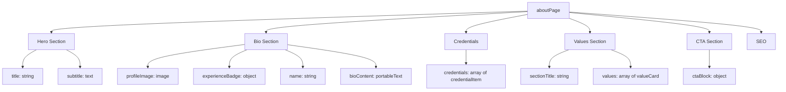
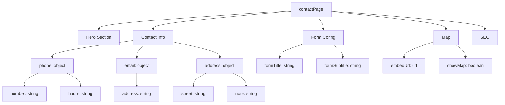
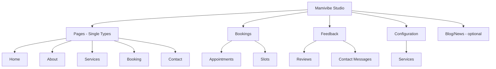

# Sanity CMS Single Pages Reorganization Plan

## Overview

This plan reorganizes the Sanity CMS structure from a generic "page" document type (suitable for blogs/news) to dedicated single-page document types (like Strapi's single types). Each page will have its own schema with custom fields tailored to its specific content sections.

## Current State Analysis

### Existing Structure
- **Generic [`page`](studio/schemaTypes/page.ts:3)** document with:
  - `slug`, `title`, `subtitle`
  - `heroImage`
  - `content` (Portable Text)
  - `seo` object

### Hardcoded Content Found in Pages

| Page | Hardcoded Content |
|------|-------------------|
| **Home** ([`src/app/page.tsx`](src/app/page.tsx:1)) | Services overview cards, fallback testimonials, intro text |
| **About** ([`src/app/about/page.tsx`](src/app/about/page.tsx:1)) | Bio text, credentials grid, values/philosophy cards, CTA section |
| **Services** ([`src/app/services/page.tsx`](src/app/services/page.tsx:1)) | Header badge text |
| **Booking** ([`src/app/booking/page.tsx`](src/app/booking/page.tsx:1)) | Minimal - mostly dynamic |
| **Contact** ([`src/app/contact/page.tsx`](src/app/contact/page.tsx:1)) | Phone, email, address, office hours |

---

## Proposed Schema Architecture

### Shared Objects (Reusable)

#### 1. `seoFields` Object
```
- metaTitle: string
- metaDescription: text
- keywords: array of strings
- ogImage: image with alt
- canonicalUrl: url
- noIndex: boolean
```

#### 2. `ctaBlock` Object
```
- heading: string
- description: text
- primaryButton: { text, link }
- secondaryButton: { text, link }
- backgroundColor: string (gradient options)
```

#### 3. `valueCard` Object
```
- icon: string (icon name)
- title: string
- description: text
```

#### 4. `portableTextContent` (reusable block content)

---

### Single Page Document Types

#### 1. `homePage` (Singleton)

```mermaid
graph TD
    A[homePage] --> B[Hero Section]
    A --> C[Intro Section]
    A --> D[Services Overview]
    A --> E[Testimonials Config]
    A --> F[SEO]
    
    B --> B1[badge: string]
    B --> B2[title: string]
    B --> B3[subtitle: text]
    B --> B4[heroImage: image]
    B --> B5[primaryCTA: object]
    B --> B6[secondaryCTA: object]
    B --> B7[availabilityNote: string]
    
    C --> C1[heading: string]
    C --> C2[content: portableText]
    C --> C3[linkText: string]
    C --> C4[linkUrl: string]
    
    D --> D1[sectionTitle: string]
    D --> D2[sectionSubtitle: string]
    D --> D3[serviceCards: array of serviceCard]
    
    E --> E1[sectionTitle: string]
    E --> E2[showTestimonials: boolean]
    E --> E3[maxTestimonials: number]
```



**Fields:**
- `hero` object:
  - `badge`: string
  - `title`: string
  - `subtitle`: text
  - `heroImage`: image
  - `primaryCTA`: { text, link }
  - `secondaryCTA`: { text, link }
  - `availabilityNote`: string
- `intro` object:
  - `heading`: string
  - `content`: portable text
  - `linkText`: string
  - `linkUrl`: string
- `servicesOverview` object:
  - `sectionTitle`: string
  - `sectionSubtitle`: string
  - `serviceCards`: array of { icon, title, description, link }
- `testimonials` object:
  - `sectionTitle`: string
  - `showTestimonials`: boolean
  - `maxCount`: number
- `seo`: seoFields object

---

#### 2. `aboutPage` (Singleton)



**Fields:**
- `hero` object:
  - `title`: string
  - `subtitle`: text
- `bio` object:
  - `profileImage`: image
  - `experienceBadge`: { number, label }
  - `name`: string
  - `content`: portable text
- `credentials`: array of { icon, title, description }
- `values` object:
  - `sectionTitle`: string
  - `items`: array of { icon, title, description }
- `cta`: ctaBlock object
- `seo`: seoFields object

---

#### 3. `servicesPage` (Singleton)

**Fields:**
- `hero` object:
  - `title`: string
  - `subtitle`: text
  - `badge`: string (e.g., "💻 Online konzultáció • 🏠 Személyes tanácsadás")
- `emptyStateMessage`: string
- `seo`: seoFields object

---

#### 4. `bookingPage` (Singleton)

**Fields:**
- `hero` object:
  - `title`: string
  - `subtitle`: text
- `instructions`: portable text (optional additional instructions)
- `seo`: seoFields object

---

#### 5. `contactPage` (Singleton)



**Fields:**
- `hero` object:
  - `title`: string
  - `subtitle`: text
- `contactInfo` object:
  - `phone`: { number, hours }
  - `email`: { address }
  - `location`: { street, city, note }
- `form` object:
  - `title`: string
  - `subtitle`: string
  - `responseTimeNote`: string
- `map` object:
  - `embedUrl`: url
  - `showMap`: boolean
- `seo`: seoFields object

---

## Sanity Studio Structure Update

The [`structure.ts`](studio/structure.ts:1) will be updated to include a new "Pages" group:



Each single-page document will use Sanity's singleton pattern - showing a direct edit view instead of a list.

---

## Implementation Steps

### Phase 1: Schema Creation
1. Create shared object schemas:
   - [`studio/schemaTypes/objects/seoFields.ts`](studio/schemaTypes/objects/seoFields.ts)
   - [`studio/schemaTypes/objects/ctaBlock.ts`](studio/schemaTypes/objects/ctaBlock.ts)
   - [`studio/schemaTypes/objects/valueCard.ts`](studio/schemaTypes/objects/valueCard.ts)

2. Create single-page document schemas:
   - [`studio/schemaTypes/singletons/homePage.ts`](studio/schemaTypes/singletons/homePage.ts)
   - [`studio/schemaTypes/singletons/aboutPage.ts`](studio/schemaTypes/singletons/aboutPage.ts)
   - [`studio/schemaTypes/singletons/servicesPage.ts`](studio/schemaTypes/singletons/servicesPage.ts)
   - [`studio/schemaTypes/singletons/bookingPage.ts`](studio/schemaTypes/singletons/bookingPage.ts)
   - [`studio/schemaTypes/singletons/contactPage.ts`](studio/schemaTypes/singletons/contactPage.ts)

3. Update [`studio/schemaTypes/index.ts`](studio/schemaTypes/index.ts:1) to export new schemas

### Phase 2: Studio Structure
1. Update [`studio/structure.ts`](studio/structure.ts:1) to:
   - Add "Pages" group with singleton document views
   - Use `S.document().documentId().schemaType()` pattern for singletons

### Phase 3: Frontend Updates
1. Update GROQ queries in each Next.js page to fetch from new document types
2. Update TypeScript types in [`src/types/sanity.types.ts`](src/types/sanity.types.ts)
3. Remove hardcoded fallback content where CMS data is now available

### Phase 4: Data Migration
1. Create initial documents for each singleton in Sanity
2. Migrate existing content from generic "page" documents
3. Optionally rename/repurpose the generic `page` schema for blog posts

---

## File Changes Summary

### New Files
| File | Purpose |
|------|---------|
| `studio/schemaTypes/objects/seoFields.ts` | Reusable SEO fields object |
| `studio/schemaTypes/objects/ctaBlock.ts` | Reusable CTA block object |
| `studio/schemaTypes/objects/valueCard.ts` | Reusable value/feature card |
| `studio/schemaTypes/singletons/homePage.ts` | Home page singleton schema |
| `studio/schemaTypes/singletons/aboutPage.ts` | About page singleton schema |
| `studio/schemaTypes/singletons/servicesPage.ts` | Services page singleton schema |
| `studio/schemaTypes/singletons/bookingPage.ts` | Booking page singleton schema |
| `studio/schemaTypes/singletons/contactPage.ts` | Contact page singleton schema |

### Modified Files
| File | Changes |
|------|---------|
| `studio/schemaTypes/index.ts` | Add new schema exports |
| `studio/structure.ts` | Add Pages group with singletons |
| `src/app/page.tsx` | Update GROQ query, use new fields |
| `src/app/about/page.tsx` | Update GROQ query, remove hardcoded content |
| `src/app/services/page.tsx` | Update GROQ query |
| `src/app/booking/page.tsx` | Update GROQ query |
| `src/app/contact/page.tsx` | Update GROQ query, remove hardcoded contact info |
| `src/types/sanity.types.ts` | Add new TypeScript interfaces |

### Optional Changes
| File | Changes |
|------|---------|
| `studio/schemaTypes/page.ts` | Rename to `blogPost.ts` or keep for news/blog |

---

## Benefits of This Approach

1. **Type Safety**: Each page has its own schema with specific fields
2. **Better UX**: Content editors see only relevant fields for each page
3. **Singleton Pattern**: Prevents accidental creation of duplicate pages
4. **Organized Studio**: Clear separation between single pages and collection types
5. **Strapi-like Experience**: Familiar pattern for those coming from Strapi
6. **Maintainability**: Easier to add page-specific fields without affecting others
